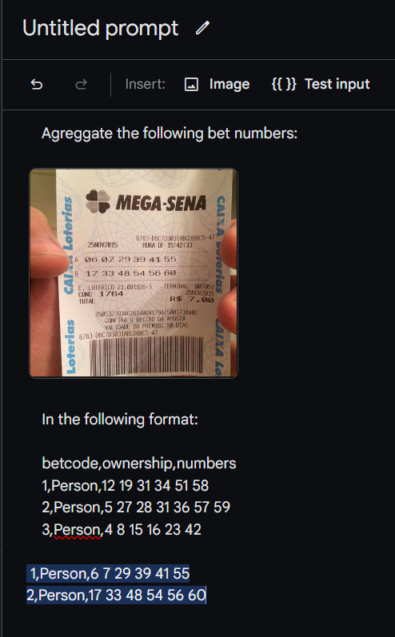

# Requirements

* [Python 3 or above](https://www.python.org/downloads/)

# Running the project locally

1. Clone the repository
2. In the project directory, run `python3 -m venv venv`
3. Activate the virtual environment by running `source venv/bin/activate`
4. Install the requirements by running `pip3 install -r requirements.txt`. You can alternatively run `pip3 install pandas` for a slimmed down environment.
5. In the terminal, run `python3 main.py` and insert the required input

To deactivate the virtual environment just run `deactivate`.

If you prefer to run Python locally without a virtual environment, just run `python3 main.py` after installing the requirements.

# Betting data

* You need a .csv file in the project directory with the betting data.

If you want to add a bet, just add a new row to the .csv file.

The format is as follows:

| betcode | ownership | numbers |
|------|-----------|-----------|
... | ... | ... |
| 49 | John Doe | 01 02 03 04 05 06 |

Which translates to:

49,John Doe,01 02 03 04 05 06

# Automating bet data insertion

This process can be automated by using Google Gemini Pro Vision:

1. Go to [Google AI Studio](https://makersuite.google.com/app/prompts/new_freeform)
2. On the right side, click "Models" and select "Gemini Pro Vision"
3. Add this prompt:

    Agreggate the following bet numbers:

     // TODO: add your own image

    In the following format:

    betcode,ownership,numbers
    1,Person,12 19 31 34 51 58
    2,Person,5 27 28 31 36 57 59
    3,Person,4 8 15 16 23 42

Gemini Pro Vision will then automatically add the bet data and output it like this:

Then, you can just copy the output and paste it into the .csv file.
